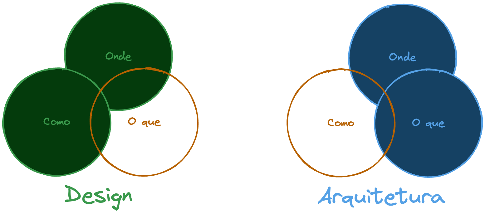
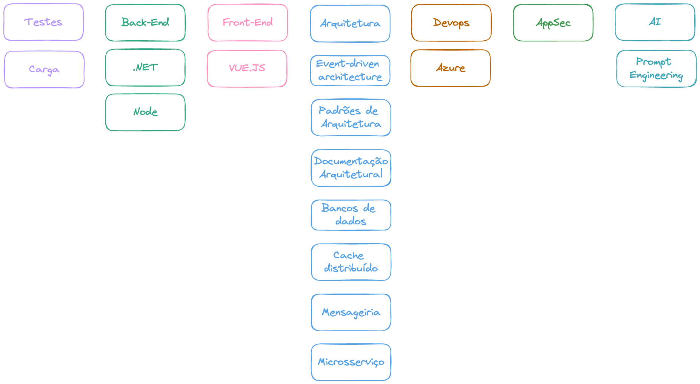

> Arquitetura é aquilo que você não consegue pesquisar no Google - Mark Richards

## Pensamento Arquitetônico

Uma das habilidades essenciais para um arquiteto, é ter esse “pensamento arquitetônico”, é o que vai diferenciar ele de um dev na hora de tomar as decisões, ele é muito mais do que só pensar na arquitetura,  se baseia em quatro principais pontos:

- Diferença entre arquitetura de design
- Conhecer vários conceitos técnicos, mas sem deixar de aprofundar em alguns pontos, o famoso profissional em T(Amplitude técnica).
- Saber os prós e os contras das soluções e tecnologias
- Alinhar as metas / problemas de negócio com a tecnologia

### Arquitetura vs. Design

**Arquitetura**(O que) define as regras e diretrizes principais para garantir qualidade e objetivos do negócio, enquanto o **design**(O como) pode incluir escolhas menores e mais flexíveis dentro desses limites.

> Arquitetura é sempre sobre Design, mas Design nem sempre é sobre Arquitetura - Elemar Jr

Mas o ponto mais importante aqui, é que esse processo não pode ser um fluxo unidirecional, onde o arquiteto desenha(arquitetura), e o dev desenvolve(design), esse processo precisa ser contínuo e de troca.

### Amplitude técnica

Ao contrário de um desenvolvedor, que geralmente se especializa cada vez mais em uma tecnologia específica (como eu me especializei em .NET), o arquiteto precisa ter um conhecimento mais amplo. Ele deve conhecer diversas tecnologias e padrões, sem necessariamente ser um especialista em todas, o que seria impossível.

O autor até comenta no livro, que é melhor um arquiteto conhecer 5 possíveis soluções para um problema, do que ser especialista em apenas uma delas, e não conhecer as outras.

Com a mudança para arquiteto, o desenvolvedor precisa virar essa chave, pois não da para ter o mesmo “padrão de conhecimento”, é impossível se especializar em tudo, então, foque um pouco mais em ter esse conhecimento amplo.

### Prós e os contras das soluções e tecnologias

Também conhecidas por *Trade-offs*, arquitetura é sempre feita deles. E por isso você acaba vendo muitos arquitetos e devs mais experientes falando **“DEPENDE”**, porque sempre depende de muitos fatores a arquitetura, como: experiência da equipe, orçamento do projeto, foco da empresa…

> Não existe resposta certa nem errada na arquitetura, apenas *Trade-offs* - Neal Ford

## Entendendo as motivações comerciais

Um dos principais papéis do arquiteto de software é transformar os objetivos de negócios em soluções arquitetônicas eficientes, considerando aspectos como escalabilidade, desempenho, disponibilidade e segurança. Portanto, é essencial que o arquiteto tenha um entendimento do contexto empresarial e mantenha uma relação colaborativa com líderes, gestores e acionistas…

## Equilibrando arquitetura e codificação

Esse é um ponto importante, no livro ele fala sobre o arquiteto participar ativamente na codificação de projetos e produtos, mas claro, sem virar um gargalo! Pois um dos papéis do arquiteto é garantir que as decisões sejam tomadas, e que ele consiga acompanhar em alto nível outros projetos, para facilitar a “organização das caixinhas(sistemas)”, e se ele fica travado em tarefas de código, acaba abrindo mão da parte mais importante.

Para isso precisamos ter um meio termo, talvez participando em tarefas menores, o que também ajuda a ter um maior contexto do time e das pessoas que fazem parte. O importante é não parar, o arquiteto precisa sim ter um conhecimento de programação e se manter atualizado, até mesmo para compreender os possíveis problemas que o time pode ter implementando as soluções que foi desenhada.

O Autor também fala de outras técnicas para se manter útil: 

- POCs
- Code Review
- Treinamentos
- Correções de dívidas técnicas
- Teste de arquitetura com ferramentas como ArchUnitNET
- Automação de tarefas

Isso tudo tem ligação direta com o que falamos na parte de Amplitude técnica
