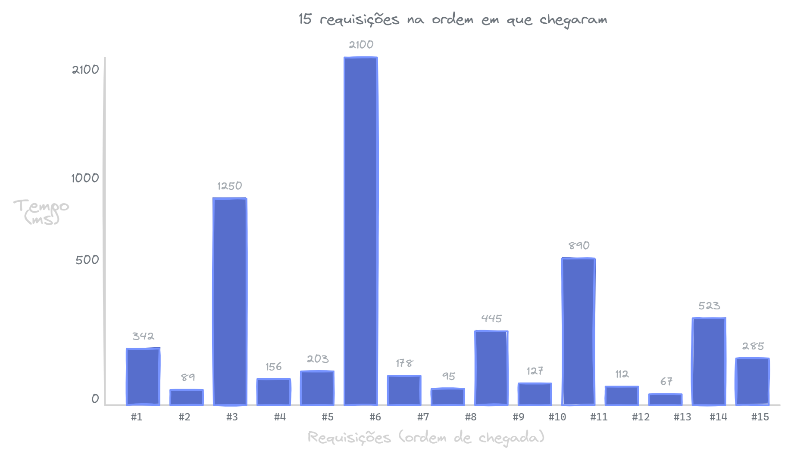
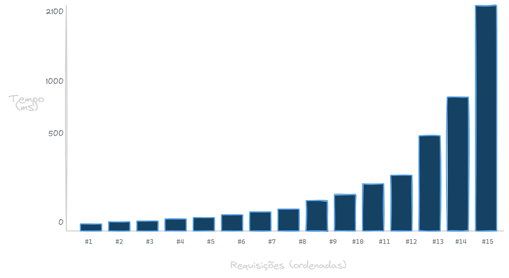
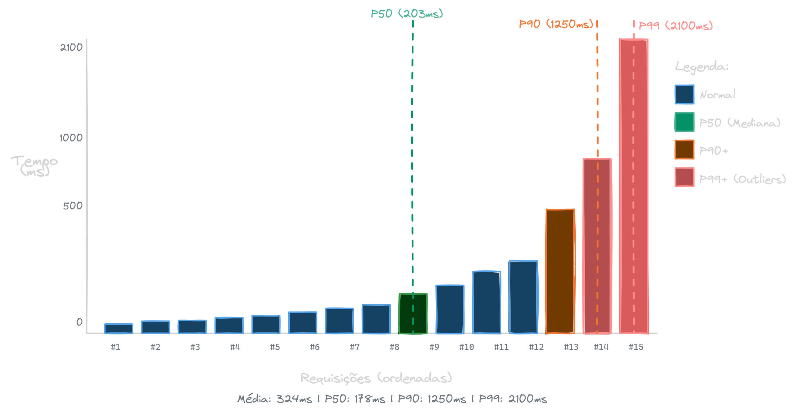

> **Disclaimer**
> Não sou matemático. Este texto não tem como objetivo trazer uma definição estatística formal de percentil. A ideia é explicar o conceito de forma simples e prática, focada na aplicação em computação, especialmente na análise de latência de sistemas.


## O que é o Percentil

O **percentil** é uma medida estatística que indica o valor abaixo do qual uma determinada porcentagem de dados em um conjunto se encontra. Por exemplo, se a latência do percentil 95 (P95) de um sistema é de 200ms, isso significa que 95% das requisições são processadas em até 200ms, enquanto apenas 5% demoram mais que isso.

No contexto de análise de latência, os percentis são fundamentais porque a **média** costuma ser uma métrica enganosa. Um pequeno número de requisições muito lentas (ou muito rápidas) pode distorcer significativamente a média, escondendo problemas reais enfrentados por uma parcela dos usuários.

### Por que usar percentis na latência?

* **Visibilidade de "Outliers":** Permite identificar os "caudas longas" (usuários que sofrem com lentidão extrema).
* **Melhor Experiência do Usuário:** Focar em métricas como P99 garante que quase todos os usuários tenham uma boa experiência, e não apenas a "maioria média".
* **Diagnóstico de Gargalos:** Ajuda a detectar variações causadas por picos de rede ou processos de *garbage collection* que não aparecem em médias simples.

## Como calcular

### Obter os dados

Exemplo de dados Base de tempo de resposta(ms)

```js
[342, 89, 1250, 156, 203, 2100, 178, 95, 445, 127, 890, 112, 67, 523, 285]
```



### Ordenar os dados

Dados Ordenados de tempo de resposta(ms)

```js
[67, 89, 95, 112, 127, 156, 178, 203, 285, 342, 445, 523, 890, 1250, 2100]
```



### Como calcular o Percentil “X“?

Primeira coisa é identificar a posição em que o valor que você procura está, exemplo, P50.

$$Posicao = \frac{P}{100} \times (n + 1)$$

**P** é percentil desejado (Ex.: 50, 90, 99) e **N** é quantidade de elementos

$$Posicao = \frac{50}{100} \times (15 + 1) = 8$$

Importante, esse não é o index do array, é a ordem "humana". Agora que sabemos a posição desse percentil, basta buscar o valor na lista ordenada, no caso:




> **Importante sobre a fórmula:**
> 
> 1. A fórmula apresentada é uma simplificação didática. No exemplo, o resultado é uma posição inteira (8), mas frequentemente o resultado será decimal (ex: 14.4 para P90). Diferentes métodos lidam com isso de formas distintas: alguns arredondam, outros interpolam linearmente entre valores adjacentes.
> 
> 2. Existem múltiplas definições estatísticas para o cálculo de percentis (tipos I-IX segundo literatura estatística). Ferramentas de observabilidade normalmente utilizam algoritmos próprios.
> 
> 3. O tamanho da amostra é crítico: percentis calculados com 10 requisições são muito menos confiáveis que com 1 milhão de requisições. Sempre considere isso ao analisar seus dados.

### Conclusão

- Média sozinha não representa a experiência real do usuário

- Percentis mostram a distribuição real da latência

- Percentis altos (P95, P99) revelam a experiência dos usuários na cauda da distribuição

- Mesmo sem entrar em matemática pesada, o conceito já ajuda muito no dia a dia

- Sempre considere o tamanho da amostra ao analisar percentis

**Para latência em produção, pense sempre em P50, P90, P95 e P99.** E lembre-se: 1% de 1 bilhão de requisições é 10 milhões de possíveis usuários afetados, por isso P99 importa.