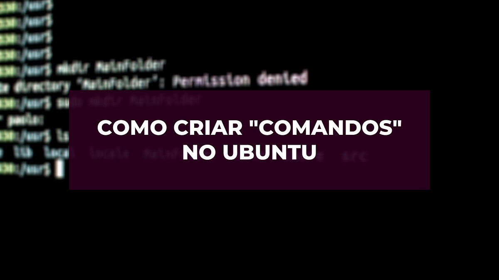

Quanto tempo você já perdeu escrevendo os mesmos comandos no terminal, ou procurando e executando scripts Shell? 
 Você pode resolver isso utilizando **alias(atalhos para comandos)**, para criar o seu alias você vai precisar do nome do seu comando, e o comando com os seus parâmetros.

`alias NomeDoSeuComando='Comando e seus parâmetros'`

Inicialmente você deve criar um arquivo na pasta do seu usuário **/home/SeuUsuario,** com o nome **.bash_aliases**, caso ele exista basta apenas edita-lo. Para criação e edição do arquivo você pode fazer do modo que achar melhor, utilizarei o editor de texto [VIM.](http://www.ubuntudicas.com.br/2012/08/vim-editor-de-textos/)

### Criando e editando o arquivo

```bash
#Criação
cd /home/NomeDoSeuUsuario
touch .bash_aliases
#Edição
vim .bash_aliases
#Se quiser utilizar um editor com interface gráfica
sudo gedit ~/.bash_aliases
```

### Criação dos comandos

Um exemplo de comando para criar, é o de atualizar, e limpar o sistema com apenas uma palavra no console, que vou chamar de AtualziarSistema.

```bash
#Script para atualizar o sistema
alias AtualizarSistema='sudo apt-get update;
sudo apt-get dist-upgrade -f;
sudo apt-get autoclean;
sudo apt-get autoremove;
sudo apt-get clean'
```

Então basta você salvar o arquivo, e tudo estará funcionando! Se futuramente você quiser adicionar novos comandos basta adicionar no fim do arquivo **.bash_aliases.**Uma boa prática na criação de novos comandos, é criar um comentário na linha que antecede o seu comando, informando a sua função.

**“O céu é o limite”**: é possível criar todo e qualquer tipo de combinação de comando para gerar o seu próprio. Você poderá criar um comando para mudar para sua pasta de projetos ou até mesmo ligar um servidor, basta seguir esses passos, e diminuirá o trabalho com a repetição de comandos no console.
